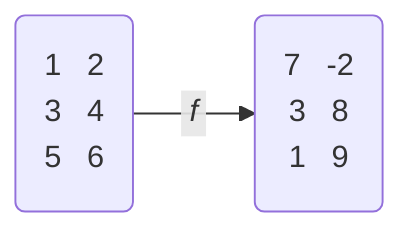

# Funções

## Definição
Associação dos elementos de $A$ com os elementos de $B$

$$f : A \rightarrow B$$

Ou então associação entre os elementos do domínio $D(f)$ com os elementos do contra-domínio $CD(f)$

$$D(f) \rightarrow CD(f)$$
$$I_m(f) \in CD(f)$$

---

## Existência de uma função
Se ao menos um valor de $x$ está relacionado a dois ou mais valores de $y$, então $f$ **não é uma função**

---

## Função sobrejetora
A imagem é igual ao contra-domínio

$$I_m(f) = CD(f)$$

## Função injetora
**Não existem** dois ou mais valores de $x$ associados a um mesmo valor de $y$

$$a \neq b \rightarrow f(a) \neq f(b)$$

## Função bijetora
Injetora e sobrejetora **simultaneamente**