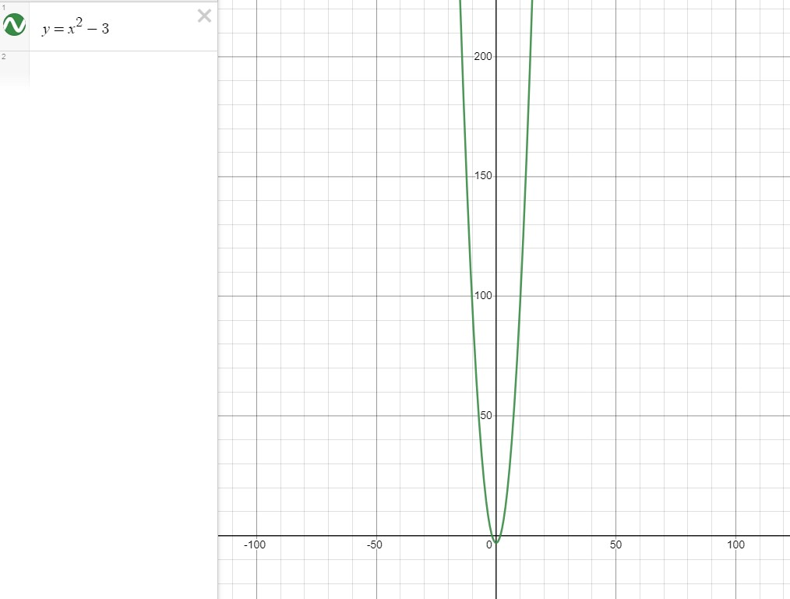
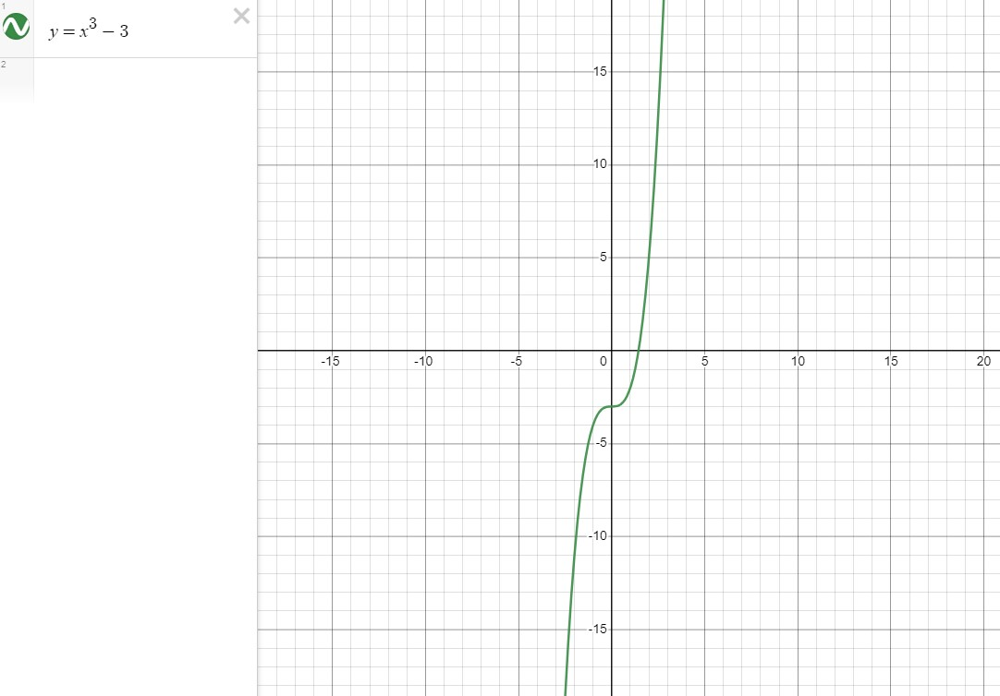

# Paridade de uma função

## Função par ($x^{p}$)

$$f(-x) = f(x)$$

**Exemplo**
- $f(x) = x^2 - 3$
$$f(3) = f(-3)$$
$$6 = 6$$

## Função ímpar ($x^{i}$)

$$f(-x) = -f(x)$$

**Exemplo**
- $f(x) = x^3 - 3$
$$f(3) = -f(-3)$$
$$24 = -(-24)$$
$$24 = 24$$

